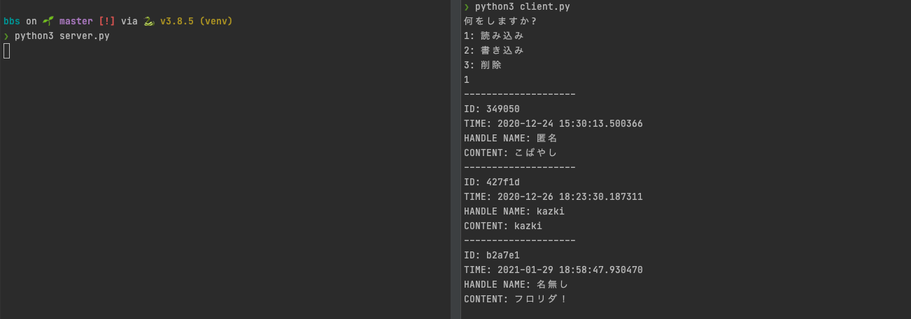

# BBS
ネットワークプログラミング期末課題


## 実行環境
- python 3.8.5

## 実行方法
### サーバーの起動
```bash
$ python3 server.py
```

### クライアントの起動
```bash
$ python3 client.py
```

## 書き込み

- 送信データ

```
state: "write"
message: Message {
  id: "string",
  time: "Date",
  handle_name: "string",
  content: "string",
  password: "string"
}
```

- 受信データ

```
{
  state: "success" | "failed"
}
```  

## 読み込み

- 送信データ

```
{
  state: "read"
}
```

- 受信データ

```
state: "success" | "failed"
messages: Message[] (passwordは含めない)
```

## 削除

- 送信データ

```
state: "delete"
{
  id: "string",
  password: "string"
}
```

- 受信データ

```
{
  state: "success" | "failed"
}
```

# 仕様

- JSONで送受信

- メッセージの蓄積  
  JSONで蓄積

- マルチプロセス  
  サーバーをマルチプロセス化  
  複数のクライアントの同時接続に対応

- 匿名書き込み禁止  
  ユーザー情報も一緒に記録する

- メッセージの削除  
  選択したメッセージを削除 IDで指定

- パスワードの設定  
  書き込んだメッセージにパスワードを設定  
  削除時にパスワードを入力
  
# 共通ロジック
- ソケットの生成
- JSON -> 文字列の変換
- 文字列 -> JSONの変換